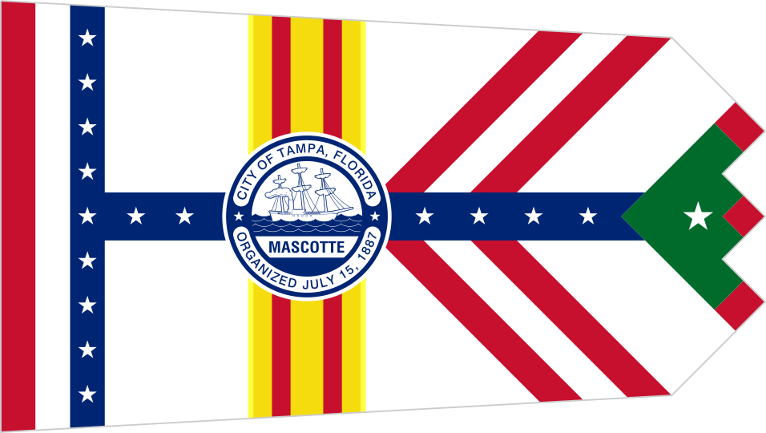

# Tampa Census

---

<figure>

<figcaption>

*The Horrifically Beautiful Tampa Flag*

</figcaption>

</figure>

1. * [Nick Nail](mailto:nnail@mail.usf.edu)
2. * [Christopher Volk](mailto:cvolk@mail.usf.edu)

---

Replace this, putting the introduction/summary of your project here. Leave the credits in the bottom section, however.

---

Created as part of the course [HIS4936, Digital Humanities I: Hacking History](https://hacking-history.readthedocs.io), by [David J. Thomas](https://github.com/thePortus) at the [University of South Florida](https://www.usf.edu)

Powered with [MkDocs](https://mkdocs.org) and [Python 3](https://python.org)
