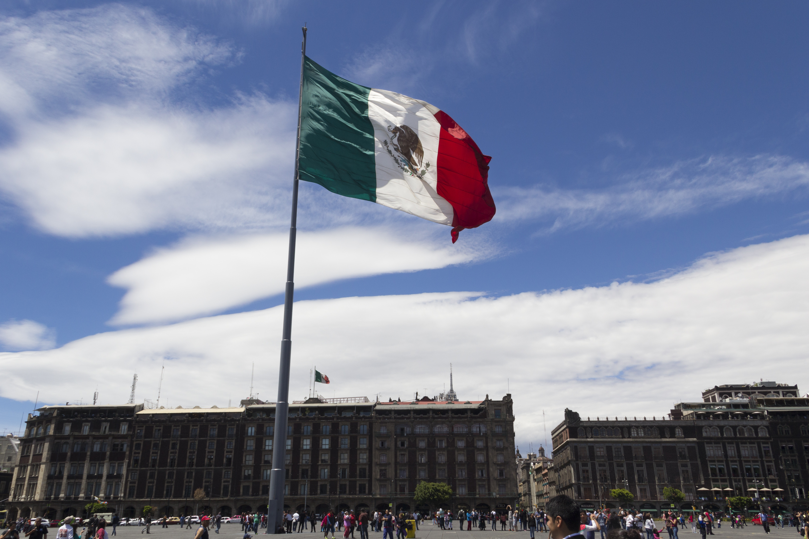

# Causes of Death in Mexico

---

*Mexico's Flag*

---

My project will examine and analyze the death rates throughout the years in Mexico as a whole and how it has either gotten worse or better. Although I will mention the cartel killings and the murders that take place, I will mainly focus on the health of the country as a whole by discussing the different diseases and illness that affect Mexico. I will gather information from various sources including the Mexican government and other international places. I plan on cleaning up the data and creating a visualization using Tableau.
---

Created as part of the course [HIS4936, Digital Humanities I: Hacking History](https://hacking-history.readthedocs.io), by [David J. Thomas](https://github.com/thePortus) at the [University of South Florida](https://www.usf.edu)

Powered with [MkDocs](https://mkdocs.org) and [Python 3](https://python.org)
