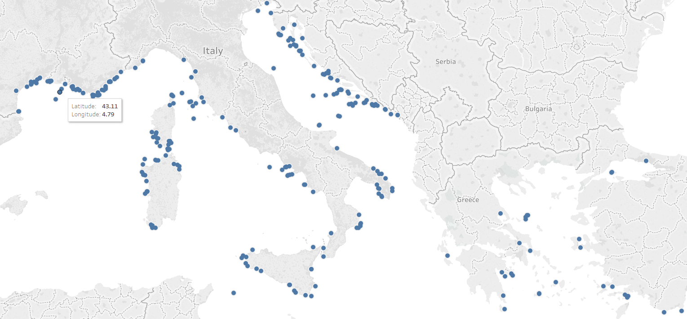
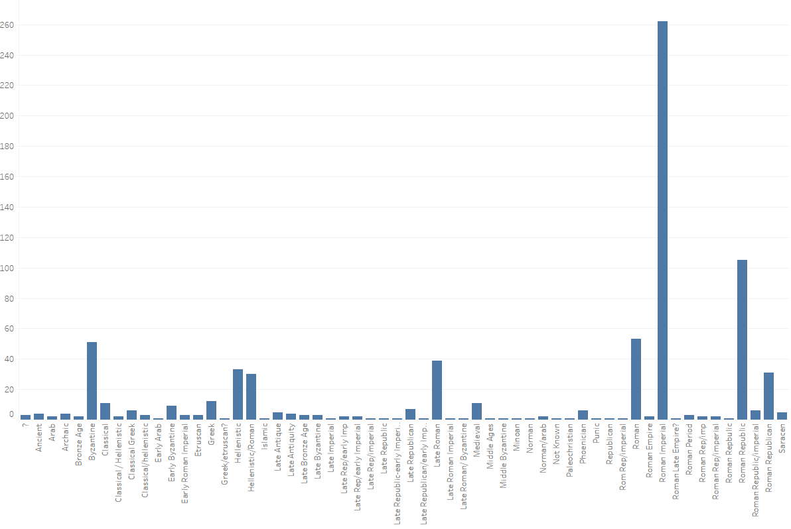
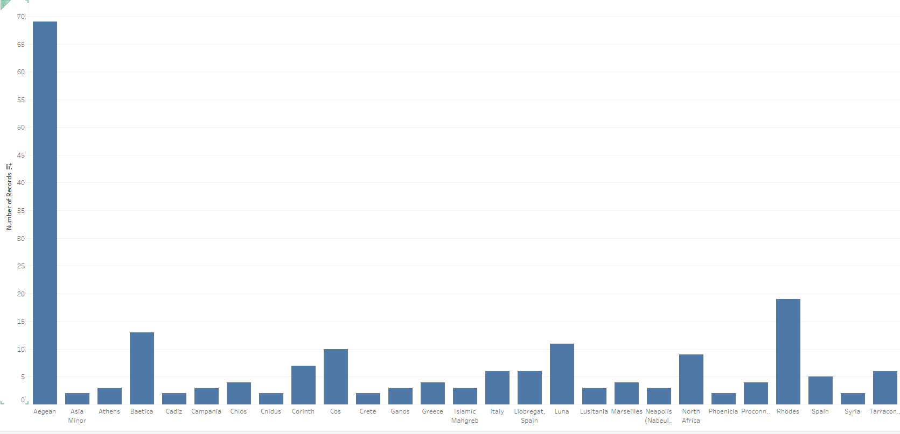
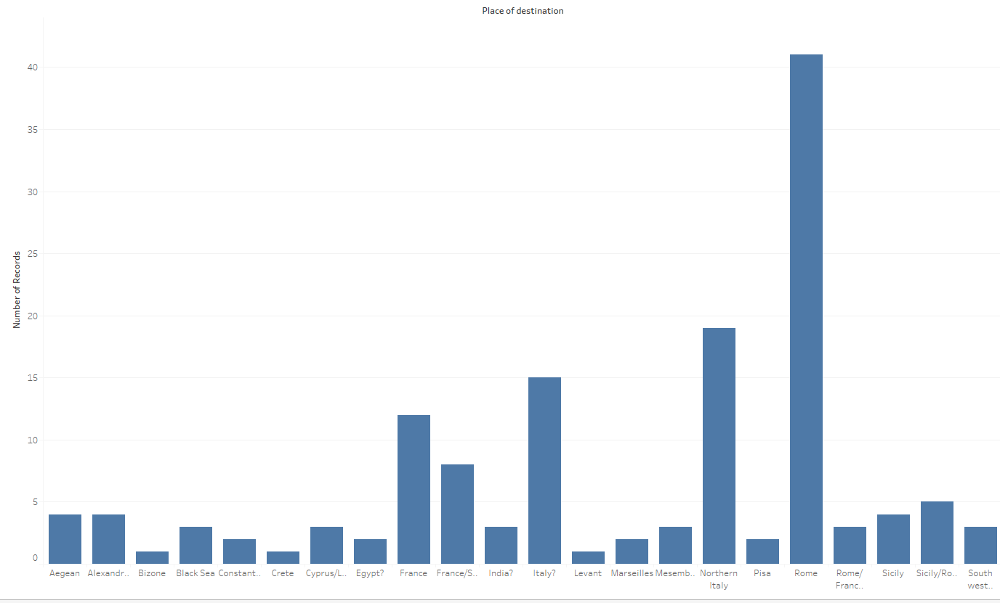

# Initial Findings

This map is a visualization of shipwrecks from trade ships found in the Mediterranean. We can assume that where there are shipwrecks there was activate trade in these locations. There are three major areas where trade occurred. Massillia seems to be one of the busiest areas of trade, followed by Illyria and lastly in the Aegean sea. The majority of the ships that were found are central to the Roman Empire. Where there were Romans there was flourishing trade. 

---

Although somewhat large, this chart helps solidify the previous statements. This visualization shows the number of ships that belong to a certain time period. The first major spike is the Byzantine, or the Eastern Roman Empire, and the Classical era. If you study the visualization there is a trend that emerges. As stated above, the trend shows that in the time of the Romans is where we find the most trade vessels. 

---

The last two visualizations help us see who was trading with who. The first visualization is a graph of where the ships place of origins were and how many of those ships came from that area. The second visualization is the number of ships destinations. By comparing the two 
we can infer who was importing and who was exporting thier goods the most frequently. The majority of the ships come from areas surrounding the Aegean but rarely any ships were headed to areas around the Aegean. We can infer that areas around the Aegean sold thier goods much more frequently than they bought goods. To further help support the assumption of the first statement, we can see from the second visualization that the majority of the ships destination was Rome. Rome was a central trade hub for all areas around the Mediterranean.  

---
# Further Attempts

Although these were just my initial findings, it would have been of great importance to have been able to designed an interactive map and to make visualizations of which areas traded which goods.  This would greatly improve the project in showing what goods were being traded to who, who exported certain goods and who imported certain goods. 
