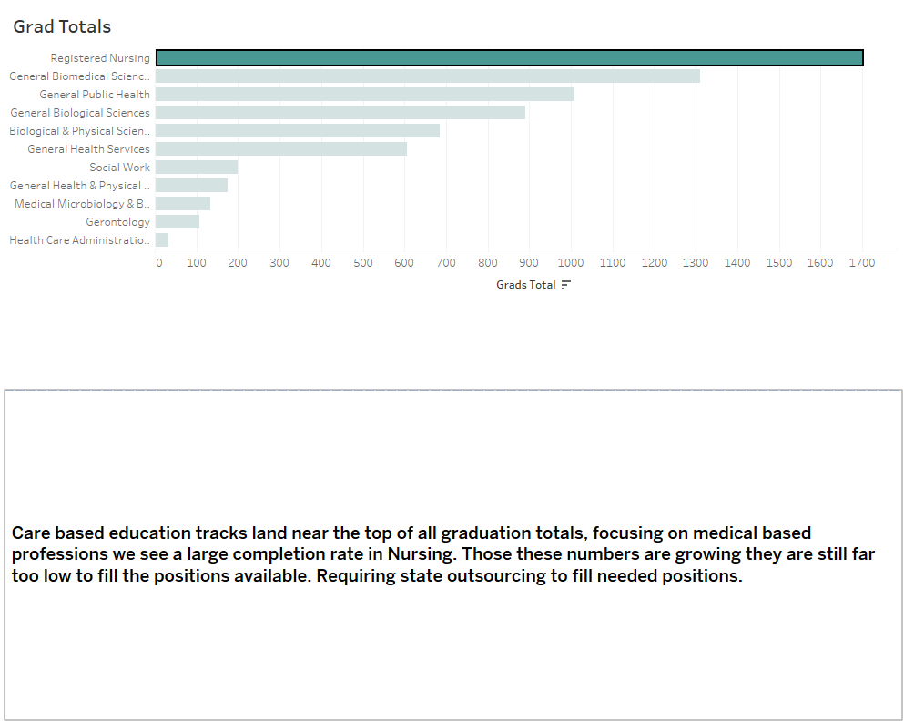
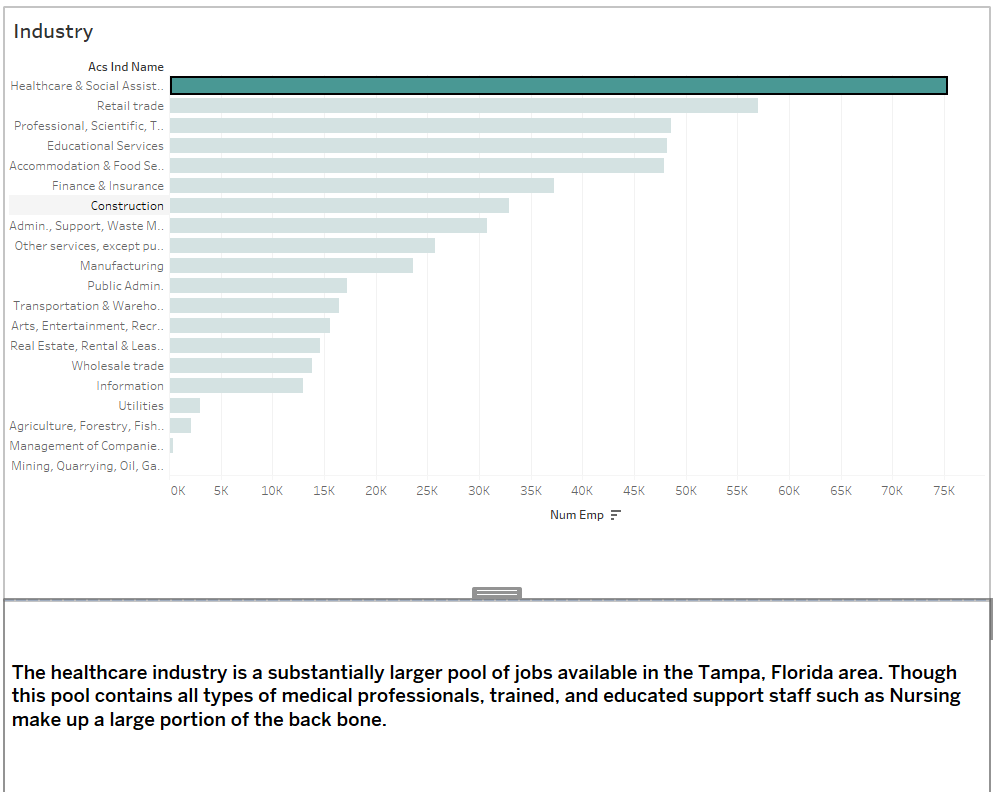
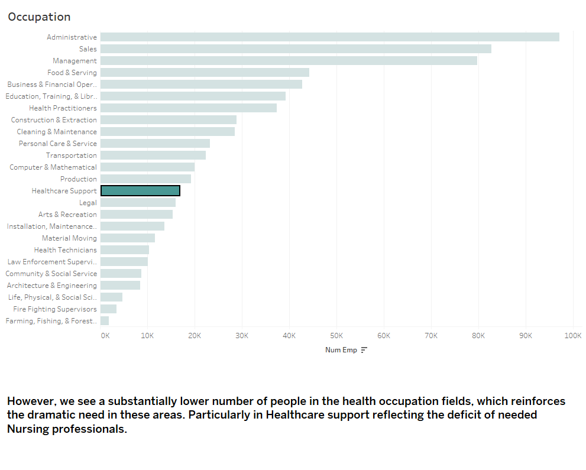

# Initial Findings

Upon paring down the census data into a focused point we were able to see a dramatic size difference in the amount of Nursing graduates and positions compared to other occupational data. With further research into news and statistics in the Tampa area we realized that this disparity is worse than originally expected. Including articles describing the lack of employees as a Nursing Tsunami, describing the amount of positions empty. To research further we compared the graduation rates of nursing professionals from the Tampa area with the size of occupational needs and the amount of people filling positions already. 
---

*Graduation Rates*

This graph focuses in on the medical professional graduation rates in the Tampa area. We can see a large number of nursing graduates over other medical positions. Further research revealed an increase in institutions offering nursing training programs. This increase in programs and the almost guaranteed access to employment has created a striking effect on attendees of these programs. 

---

*Industry size*

Further research yielding more confirming data. As we see in the image above the nursing and medical fields vastly surpass other industry fields. This data includes other health professionals as well but demonstrates appropriately the need for increased educated workers in the medical industry. 

---

*Occupation*

In comparison the number of employees currently in the nursing occupation is staggering low. In the graph above we see the disparity in educated workers versus skilled, uneducated workers. The larger numbers in occupations such as Sales, Food & Serving, and Cleaning & Maintenance demonstrates the large concentration of employees separated by education requirements from these needed positions. 

---

#Further annalysis needed

With these findings in mind a more thorough analysis of larger data pools would be necessary. Knowing the average amount of out of area employees being added to the pool, as well as the amount leaving would directly affect the position to employee ration. Additional consideration should be made for the availability of the education tracks needed to reach these positions.
