# Initial Findings  

David Thomas provided our group with txt files that he obtained from a scraping he accoplished in 2017. Upon receipt of the txt files, we attempted to upload them into [Tableau](https://tableau.com). The mission was a failure. After discussing, we realized that we could not upload txt files into Tableau, and that data had to be produced through [Orange Three](https://orange.biolab.si) first, and a csv file would need to be downladed. 

 After uploading the txt files into Orange Three, we began trying various methods of analysis. Most of them were a downright failure, especially the word cloud that was generated, absolutely no inherent meaning could be derived from the visual Orange Three produced. We imagined that AIDS, ACT, UP, or activism would be the most commonly used words in the word cloud. However that was incorrect, from viewing this visualization, the viewer has absolutely no idea ot context as to what ACT UP's oral histories discuss.   
 
 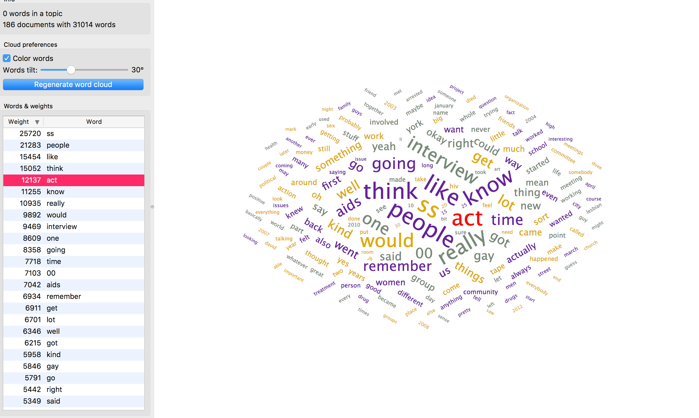

We decided that we wanted to see how often certain words appeared within the entire collection of oral histories. Using Orange Three's concordance tool, actually worked successfully and generated meaningful concordances. However, we were unable to produce a visualization from said concordances. 

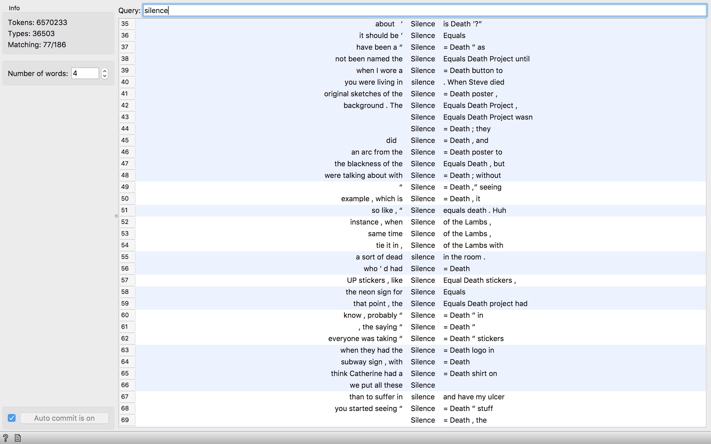

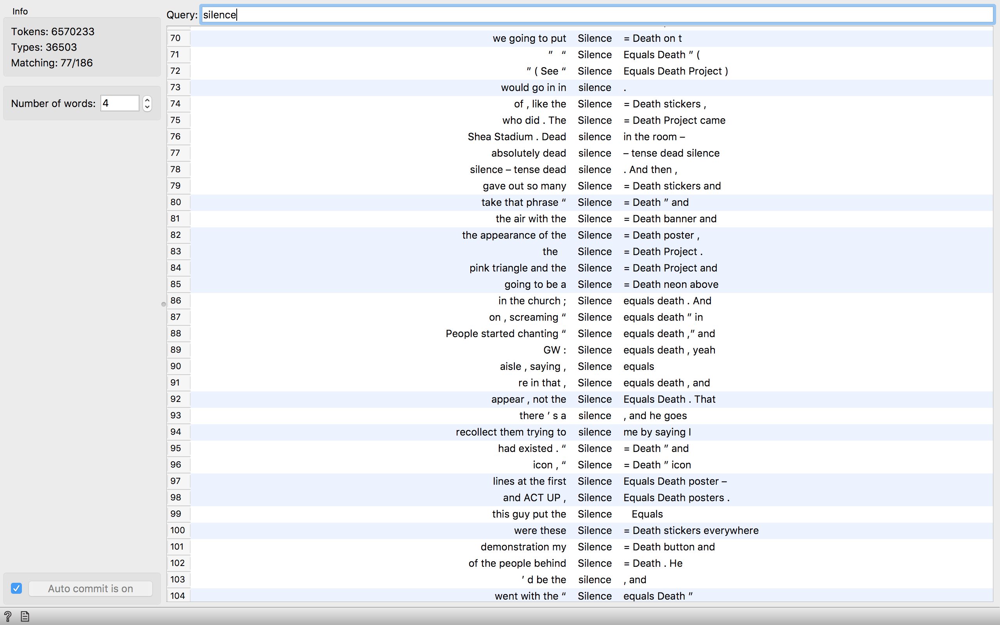

As you can see in the photo above, the Silence = Death campaign was mentioned in 77/186 interviews. The word "silence" was not the only word that we attempted to use to find concordances, we also used the word "AIDS". AIDS proved to be a far more common word than silence. Having appeared in every single one of the 186 interviews, AIDS was uttered 7042 times to be exact. From the list of concordaances, one may discern how AIDS was used and words that often came before and after AIDS. 

With the assistance of David Thomas, we were able to successfully save data from Orange Three. The file that Orage Three generated was a csv file. Thomas then aided us in opening the csv file. Initially the file would not open in Tableau. We then opened the file using Excel and we re-saved the file as a csv a second time. Once the file was re-saved in Excel, we attempted to upload it into Tableau, and finally we were able to successfully use Tableau to create a visualization! That was quite a relief. 
We were able to use a sentiment analysis tool in Tableau and produce a horizontal bar graph that depicts the negativity and positivity score of each interview. 

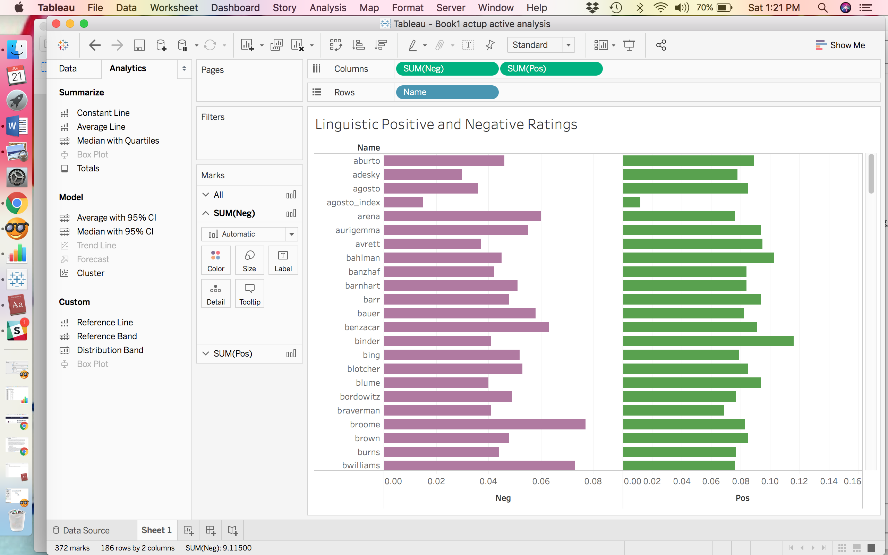

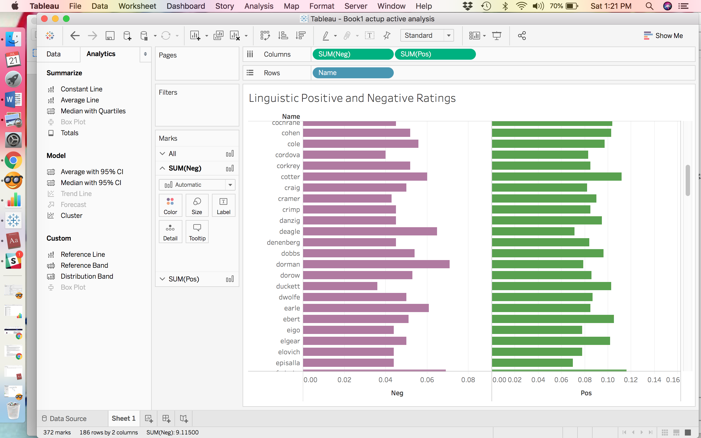

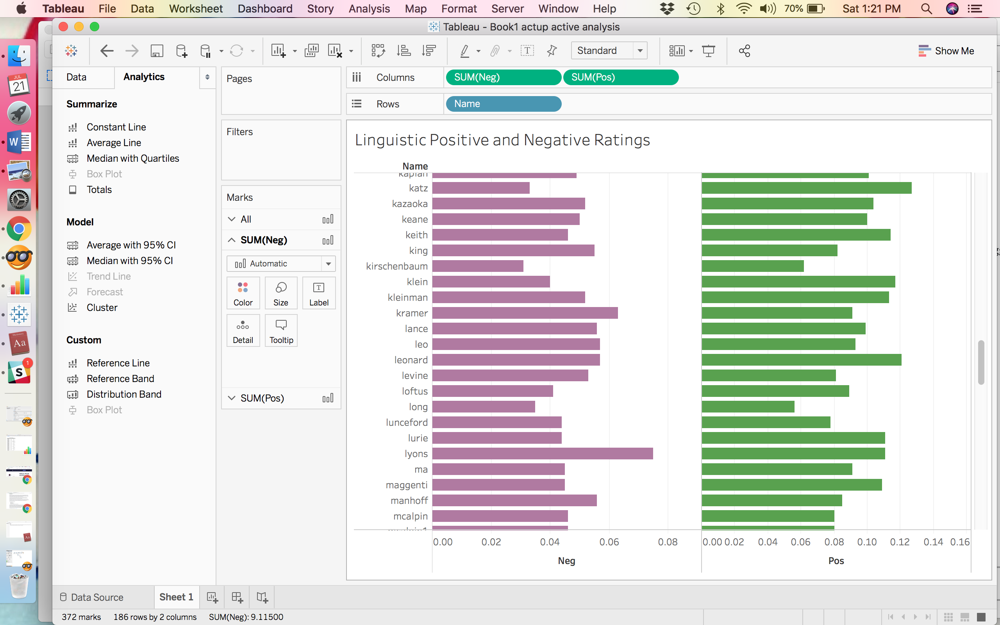

In the graphs above you can see that each interview has a unique negativity and positivity rating. For example, you can see that the Katz interview is has a far highter positivity than negativity rating. And, Lyons' interview appears to be far more negative than the other interviews in the photo. Additionally in the other photo, you can see that Dorman's negativity rating is very close to the positivity rating, Neg:0.7100 and Pos: .0790. Dorman, like Lyons' interview has the highest negativity ratings within the grouping in the photo, but Lyons' positivity rating, coming in at 0.1110 is much lower than Dorman's.

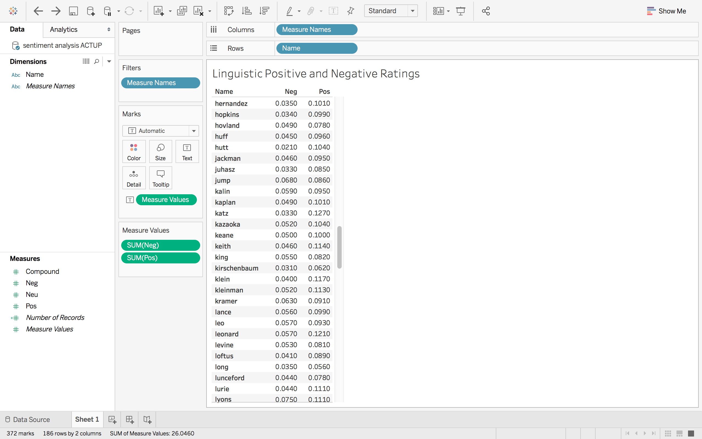

The text table above is another example of how a negative and positive rating can be visualized with Tableau. Using the exact same data set as before, we created a text table. The table is definately a more strait forward presentation of the data, having the exact rating displayed next to each name. I believe the table could be used in a fashion that orders by rating rather than alphabetically. We weren't familiar enough with Tableau to do this, however if it was doable we believe it would demonstrate the most positive and the most negative interviews. 

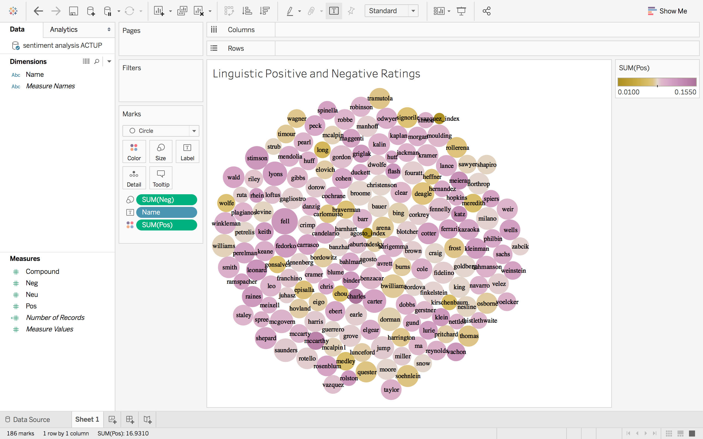

The visualization above is of packed bubbles, this was also created inside of Tableau. The higher the negativity rating the larger the bubble, and the higher the positivity rating the deeper the tone of purple the higher the positivity rating. The deeper the yellow hue the lower the positivity rating is. The names are also listed, so once you are aware of the way the data is being presented, differences in size and color which indicate differences in the data become evident. Take for example, the name Charles appears towards the bottom and has the deepest hue of purple of all the bubbles, it also appears relatively small. Without clicking on the name Charles, I already know that it has a high positivity rating due to the color and a low negativity rating due to size. 

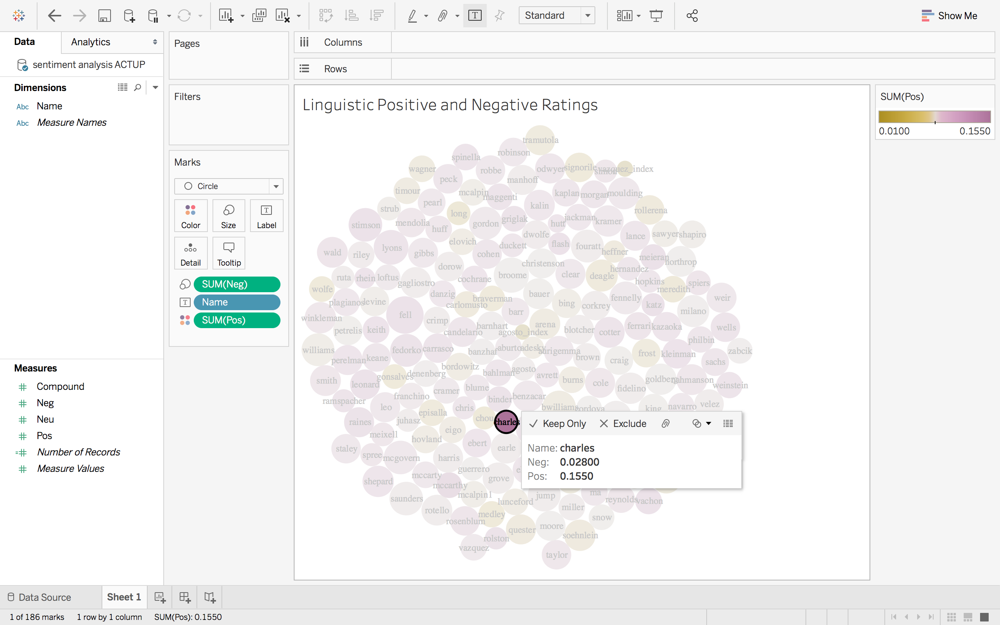

As you can see in the photo above, when we click on the name Charles the exact ratings are viewable, which were: Negative 0.02800 and Positive 0.1550. But, even without clicking on the name Charles, we knew based on the size and color what kind of ratings the Charles interview had. On the other end of the spectrum, looking at the entire pack of bubbles, one could figure out that the Deagle interview towards the top right appears in a light mustard hue suggesting a moderate positivity rating and the large size suggests a high negativity rating, which is exactly how the Deagle interview rates. As far as the choice of colors for the packed bubbles, they were chosen to show contrast and to be viewable to people with color blindness.     

For comparison, we also put the data into the program [Voyant](http://voyant-tools.org/), to moderate success. After a quick upload of the txt files provided by Professor Thomas, we were able to create a couple more visualizations. For instance, we created word tree based around the term "gay." This shows the most common phrases with that word. Ignoring some of the more common words like "of" and "the," we were interested to find the terms "young" and "hidden" among the most common in front of the term "gay." Perhaps emphasizing the climate for gay men at the peak of ACTUP, young and primarily hidden.

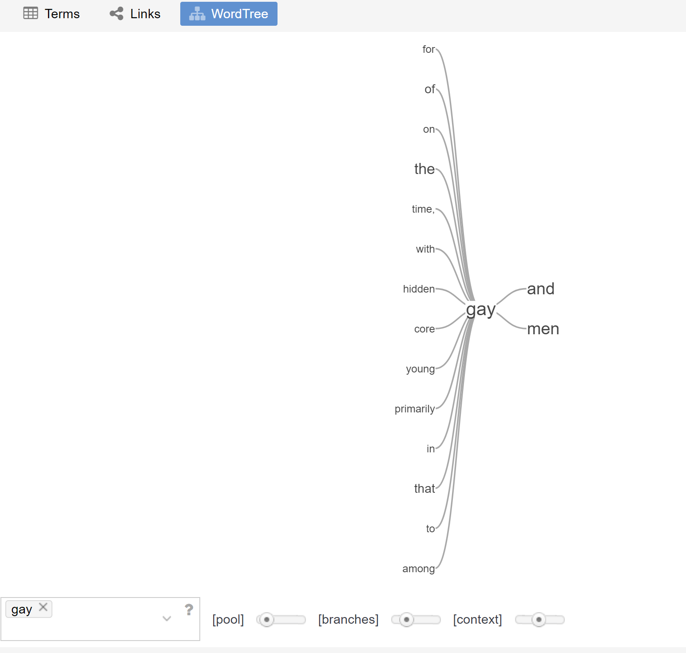

Additionally, we also created a chart of correlations. Among the most correlated words were "aids" and "gay" to "people." Again, it would appear that there was a focus within these interviews on the people of the ACTUP movement. Possibly showing that the interviewees would often talk about themselves as well as their friends/ colleagues within the group. Or, maybe this signifies them speaking as their critics. It is hard to come to a definitive conclusion with these tools, nonetheless, the information is interesting and does give us some insight into the overall context of these interviews. All without having to read all 186 in detail.

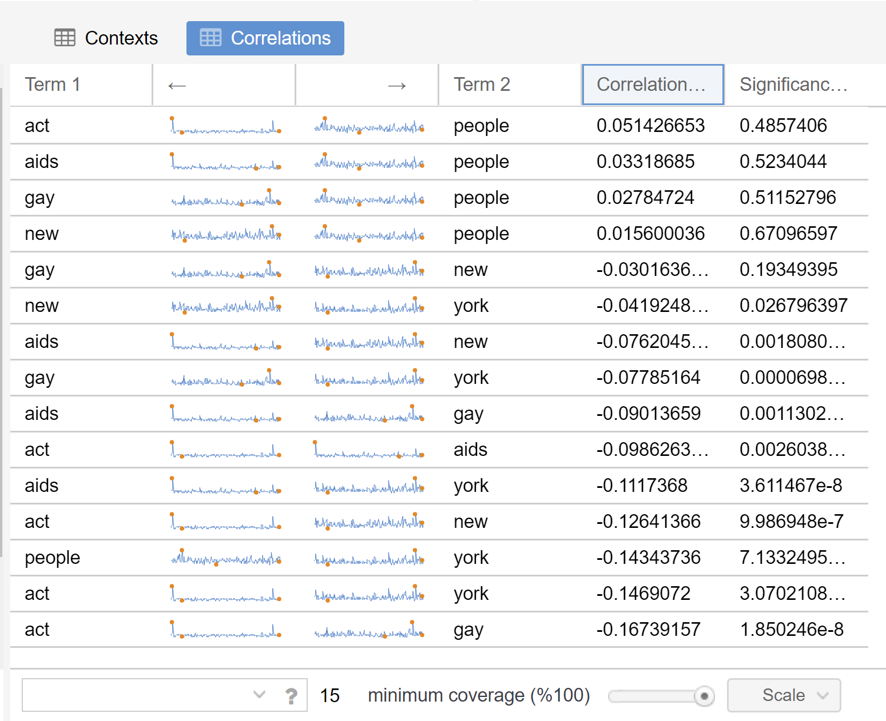

## What does all this mean?

From these visualizations, we believe than one could potentially discern how the subjects talked about the AIDS crisis and their ACT UP membership. Their emotions and sentiments about their lived experience. This is not an exact science, and the meaning we derived may be minimal, but there are obviously unique differences from one individual to another and we believe that has the potential to mean something. 

As students of digital humanities, we were aware that it was necessary to consider that this information is not objective. The interviewer, Sarah Schulman, asked 186 particular people, very particular questions. These interviews did not occur in a vacuum, nor did the activism they are being interviewed about. Similiarly, we must consider objectivity and bias when we are discussing such a political and highly personal topic such as AIDS activism and activists. The topic of AIDS is one which needs to be approached with sensitivity to begin with, it is a disease that impacted the LGBT community in a disproportionate fashion in the 1980s. People are discussing a time of crisis, death, marginalization, the loss of friends and family. These interviews have an inherently emotional demension in their scope, as do most oral histories. 

Time is another thing to consider when exploring the objectivity of a source. These subjects were interviewed decades after the initial AIDS crisis began, there was a great deal of time for the individuals to reflect on the past and process their emotions and form opinions. The context of the 1980s and the world in which ACT UP commenced, is not the same world in which these individuals occupied at the time of the interviews in the 21st century. Another topic of consideration is that the individuals that participated in ACT UP's oral history project had knowledege that they were being recorded and that their interviews were part of a larger project of ACT UP. Even after considering all of the issues that one could possibly find in the data we derived from ACT UP's oral histories, they are still valuable sources that provide a tremendous amount of contect into the activism of ACT UP and the emergence of the AIDS crisis. The knowledge that is offered within this collection far out weighs the possible issues with objectivity. Especially when a scholar is cognizant of the problems with the source before engagement with said source.      

