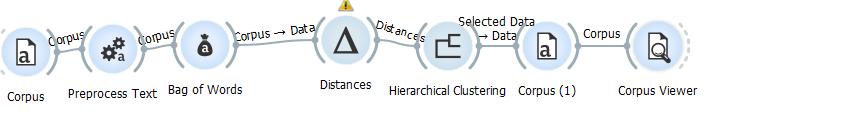

# Workflow

The author chose to analyze the emails of Hillary Clinton released by WikiLeaks out of a desire to work on a project that possessed political dimensions. The author received a copy of the emails from Prof. David J. Thomas, in both a CSV and TXT format. While Prof. Thomas sent all the emails from WikiLeaks (roughly eighteen thousand) to this author, the author’s computer was unable to process such a large dataset in Orange 3, which forced him to reduce the CSV file to approximately three thousand emails. The author used Orange 3 to analyze the data because it gave him the ability to use hierarchical clustering for text analysis - a technical description of the technique can be found [here](https://docs.orange.biolab.si/3/data-mining-library/reference/clustering.hierarchical.html) – which was useful given the large amount of emails (Orange, n.d.).  
	

	
	
Once the author reduced the size of the files, he used Orange 3 to analyze them. In Orange, the author used a “Corpus” widget to view the CSV, ran it through “Preprocess Text” to clean up the file, then put it into “Bag of Words” so it would have a numerical value. After putting Clinton’s emails through the “Bag of Words” widget, the author put it in “Distances,” so it would group emails with similar words together, and then ran it through “Hierarchical Clustering” to make the email clusters visible to the author.
	
	
	

