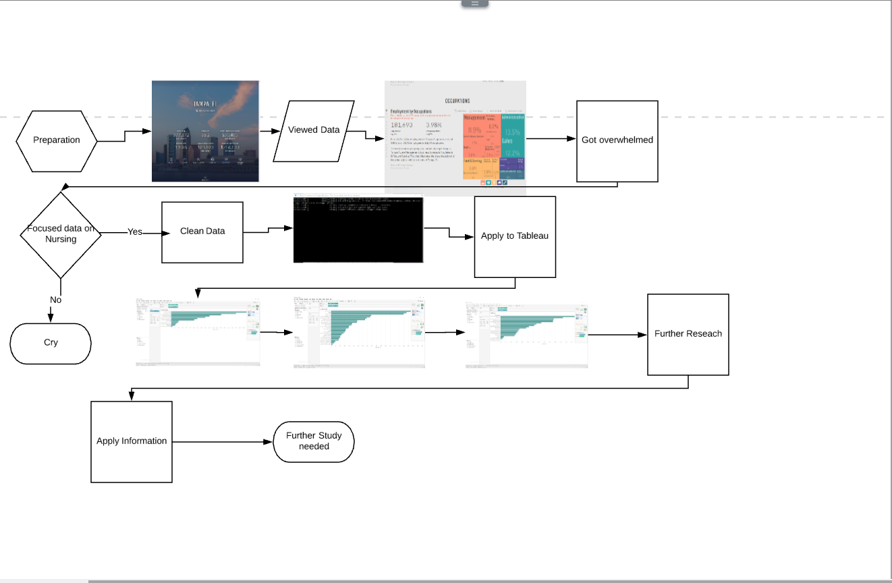

# Workflow

---
## Workflow Chart

This is the basis for our Digitalization project. We seperated our group into two sections to help play to each group members strengths

---

 ## Getting The Data
 
 
 
 The first step of visualizing our data is to download the information from our website. Luckily for our group the website contains a frozen version of the database so we could directly import our project into our next step.
 
 ---
 
 ## Cleaning the Data
 
 
 
 The Second step of our project was to clean the Database we have. I uploaded the dataset into OpenRefine. OpenRefine allows me to get rid of any whitespace, fix capitalization and to merge any outliers. This allows for our group to have a more streamlined project. 
 
 ---
 
 ## Visualizing the Data
 
 
 
 The last step of the project is to import the cleaned dataset into Tableau. Tableau is software that allows you to import a dataset and visualize the data you have collected. My main concerns with our data was to find where shipwrecks are clumped, the ships origins and destination and lastly the ships cargo. Unfortunately, this is where we ran into our first problem. The dataset uses [True] & [False] entries to describe whether the ship was carrying Aphoras, Sarcophogas or Marble. If a ship was carrying an Amphora the cell for the ship under Amphora would be [True] if it was not the cell would be filled as [False]. I could not figure out how to visualize what percentage of ships were carrying which cargo with the [True] and [False] entries. 
